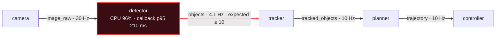

# ROS Graph Debugger

[](https://github.com/rsasaki0109/ros_graph_debugger/actions/workflows/ci.yml)
[](https://docs.ros.org)
[](LICENSE)
[](https://rsasaki0109.github.io/ros_graph_debugger/)

**Runtime DevTools for ROS 2.** A live, AI-friendly view of your running ROS 2
system: the graph, topic rate / bandwidth / message size, QoS, TF freshness,
diagnostics — and an issue panel that tells you *where to look next*.

Not a replacement for `rqt_graph`. It overlays runtime metrics and bottleneck
detection on the graph, and exposes everything as a web view, JSON, Markdown,
and an MCP server so AI assistants can debug your robot with you.

> Works with **Autoware** and **Nav2** via profile packs. Built for **ROS 2
> Jazzy / Humble** on Ubuntu 24.04 / 22.04.

> 🌐 **Try it in your browser — no install:**
> **[rsasaki0109.github.io/ros_graph_debugger](https://rsasaki0109.github.io/ros_graph_debugger/)**
> — the real web UI playing the scripted bottleneck demo, fully client-side.
>
> 🎬 **Or run it locally:** `ros2 run ros_graph_debugger rgd serve --demo`
> — the same scripted pipeline with a transient bottleneck, in the real web UI.

The `--demo` pipeline at the moment it stalls — the detector's **210 ms
callback** throttles `/objects` to **4.1 Hz**, and the tool flags it as one
issue with evidence:



> The whole-system view, the focused pipeline path, and the issue evidence are
> in [docs/example_briefing.md](docs/example_briefing.md) — exactly what an AI
> sees. _(An animated GIF of the web UI is coming.)_

---

## 60-second quick start

```bash
# build
cd ~/your_ws && colcon build --packages-select ros_graph_debugger
source install/setup.bash

# run the agent (opens http://localhost:3939)
ros2 run ros_graph_debugger agent

# in another terminal, run the demo pipeline
ros2 run ros_graph_debugger demo_pipeline
```

### See it instantly — no robot, no ROS graph required

```bash
ros2 run ros_graph_debugger rgd serve --demo     # → http://localhost:3939
```

Replays a scripted `camera → detector → … → controller` session in the real web
UI: the detector stalls in the middle, its output topic and node turn red, the
bottleneck issue appears, and `map → base_link` goes stale — then recovers. Use
the timeline at the bottom to scrub through it. This needs no DDS, so it's the
fastest way to try the tool (and to record a demo GIF). Replay any captured
session the same way: `rgd serve run.rgd.json`.

---

Open <http://localhost:3939>. With a live system you'll see:

```
camera → /sensing/camera/image_raw → detector → /perception/.../objects → tracker → planner → controller
```

The detector periodically enters a "slow" phase. Watch its output topic turn
**red**, the node turn red, and an issue appear:

> **[CRITICAL] Likely bottleneck: detector**
> detector output /perception/object_recognition/objects dropped below
> expectation while its inputs look healthy and it is CPU-bound.
> - Evidence: /perception/object_recognition/objects: 4.4 Hz (expected >= 10.0);
>   detector CPU: 95%; /sensing/camera/image_raw: 30.0 Hz

Run with the Autoware profile to get expectations and pipeline grouping:

```bash
ros2 run ros_graph_debugger agent --profile autoware
```

---

## Why

ROS 2 debugging is fragmented across `rqt_graph`, `ros2 topic hz`,
`ros2 topic bw`, `ros2 topic echo`, `ros2 doctor`, TF tools, `/diagnostics`,
and `htop`. Finding "why is my pipeline slow" means bouncing between all of them.

ROS Graph Debugger puts graph, metrics, QoS, TF, diagnostics, and bottleneck
detection into one live view — and one Markdown briefing you can hand to an AI.

## Features (v0.1)

- **Live ROS graph** with auto layout (pub → topic → sub), plus a **Network
  view** — a sortable/filterable table of every topic (rate, bandwidth, p95
  size, QoS, status), like a Chrome DevTools Network tab for ROS — and
  dedicated **TF tree** and **Diagnostics** views.
- **Topic metrics**: rate, bandwidth, avg / p95 message size (opt-in probing).
- **QoS mismatch detection** — the classic "connected but no data flows" trap.
- **Message latency (Tier A)** — `header.stamp` age (p50/p95) on probed topics,
  with a freshness issue when it exceeds a profile's `max_age_ms` (e.g. stale
  localization). Cheap approximation now; tracing-based tiers below.
- **Callback execution time (Tier C)** — per-callback p95/mean/max duration, a
  `slow_callback` issue when a callback blows its budget, and the stat surfaced
  in the node Inspector and AI briefing. Budgets are **stage-aware** — the
  Autoware/Nav2 profiles give control callbacks a tight (~10–15 ms) budget and
  planning a looser one, so the same 60 ms is fine for a planner but a violation
  for a controller. Feed **real** traces with `agent --trace-file run.ndjson`
  (one `{node, callback, topic, duration_ms}` per callback invocation →
  aggregated to count/mean/p95/max); the `--demo` shows it synthetically. See
  [docs/tracing.md](docs/tracing.md) for the capture-and-convert workflow.
- **Node CPU / memory**, with honest node→process mapping confidence: layered
  matching (`__node:=` remap → `high`, executable name → `medium`, bare token →
  `low`) and component containers capped at `low` since per-node CPU can't be
  split.
- **TF freshness** — stale transform detection, plus a **TF tree view** that
  renders the live `/tf` forest (parent → child) with per-edge age and
  static/dynamic badges.
- **/diagnostics** ingestion (WARN / ERROR become issues), plus a
  **Diagnostics view** — every status grouped worst-first with level, message,
  and hardware id.
- **System health verdict**: a one-line rollup — `OK` / `DEGRADED` / `CRITICAL`
  with the top issue — in the web header chip, at the top of the AI briefing,
  and at `GET /api/v1/summary`. The bottom line, first.
- **Issue panel**: each issue has a plain-English explanation, evidence, and
  suggested actions, ranked by severity — and selecting a node or topic lists
  the issues touching it right in the Inspector, one click from the full panel.
- **Pipeline path** — trace the constraining source→sink route through any node
  or topic (it follows the lowest-rate link at each branch), so a bottleneck
  reads as `camera → … → detector → /objects (4.1 Hz ⟵ slowest) → tracker → …`.
  Selecting a node **lights the path up on the graph** (constraining hop in
  red); also in the node Inspector, the focused AI briefing, and
  `GET /api/v1/path`. Each hop also carries the consuming node's **callback
  p95**, so the path shows the rate bottleneck *and* the execution bottleneck
  together (`detector [cb 210 ms ⟵ slowest cb] → /objects (4.1 Hz ⟵ slowest)`).
- **Profiles**: `autoware`, `nav2`, `moveit` (grouping + expected rates, incl.
  regex patterns like `^/control/command/.*` that set a floor for a whole stage).
- **Live tuning**: a Settings tab (and `POST /api/v1/config`) to adjust expected
  rates and thresholds at runtime — no restart, the issue engine picks it up.

## AI-friendly by design

> 📄 **See exactly what an AI sees:** [docs/example_briefing.md](docs/example_briefing.md)
> — the real briefing from `--demo` at the moment the detector stalls (bottleneck,
> stale TF, slow callback, and the focused pipeline path).

The whole runtime state is available in three machine-friendly ways:

| What | Endpoint | Use |
|---|---|---|
| Structured JSON | `GET /api/v1/snapshot` | programmatic access |
| **Markdown briefing** | `GET /api/v1/snapshot.md` | paste into an LLM / agent |
| **Focused briefing** | `GET /api/v1/snapshot.md?focus=TARGET` | just one node/topic + neighbours (also a "Copy AI briefing" button on every node Inspector **and issue card**) |
| **MCP server** | `python -m ros_graph_debugger.mcp_server` | let Claude query the live graph |

The web header also has one-click **⤓ JSON** / **⤓ MD** buttons to download the
current snapshot or briefing to a file (handy for attaching to a bug report or
handing to an AI offline).

```bash
# grab an AI-ready briefing from anywhere
curl http://localhost:3939/api/v1/snapshot.md

# or via the CLI
rgd markdown
```

Register the MCP server with Claude Code:

```bash
pip install "mcp[cli]"
claude mcp add ros-graph -- python -m ros_graph_debugger.mcp_server
```

Now an AI assistant can read the live robot — `get_runtime_briefing`,
`get_node_briefing(target)` (a focused briefing for one node or topic and its
neighbours — the right size for a large Autoware/Nav2 graph),
`get_pipeline_path(target)` (the constraining source→sink route, to reason about
*where* a pipeline is slow), `get_issues`, `get_graph`,
`get_topics`, `get_nodes`, `get_tf`, `get_diagnostics`, `get_callbacks`,
`get_config` — and
**act** on it: `set_expected_rate(topic, min_hz)` encodes what "healthy" looks
like for a topic at runtime, so the issue engine starts flagging it immediately.
No restart, no file editing.

## Safety: probing is opt-in and bounded

The graph, QoS, TF, and diagnostics are collected **passively** (no data
subscriptions). Message-rate probing uses lightweight raw subscriptions and is
deliberately conservative:

- Large sensor topics (`Image`, `CompressedImage`, `PointCloud2`, `LaserScan`)
  are **never** probed automatically.
- At most `--max-probe-topics` (default 12) topics are probed.
- Narrow the scope explicitly with `--probe-topic`, `--probe-regex`,
  `--probe-large-topics`, or disable entirely with `--no-probe`.

```bash
ros2 run ros_graph_debugger agent \
  --probe-regex '^/perception/.*' --max-probe-topics 20
```

## CLI

```bash
ros2 run ros_graph_debugger agent [--profile autoware] [--port 3939] ...

# one-shot queries (rgd talks to a running agent over REST)
ros2 run ros_graph_debugger rgd snapshot --out snap.json
ros2 run ros_graph_debugger rgd markdown        # AI briefing to stdout
ros2 run ros_graph_debugger rgd issues          # list current issues
ros2 run ros_graph_debugger rgd doctor          # is the agent up?

# fleet: merge several robots' agents into one AI briefing
ros2 run ros_graph_debugger rgd federate robot1=http://10.0.0.2:3939 robot2=http://10.0.0.3:3939

# ...or serve the merged fleet live in the web UI
ros2 run ros_graph_debugger rgd federate --serve robot1=http://10.0.0.2:3939 robot2=http://10.0.0.3:3939
```

### Record & report

Capture a window of runtime and turn it into a shareable report — ideal for bag
replay analysis and CI bottleneck checks (no live ROS needed to read it back):

```bash
# record 30s of snapshots (streams NDJSON to disk)
ros2 run ros_graph_debugger rgd record --out run.rgd.json --duration 30

# self-contained HTML report + AI-friendly Markdown
ros2 run ros_graph_debugger rgd report run.rgd.json --html report.html --md report.md

# or replay the captured session in the web UI with a time-scrubber
ros2 run ros_graph_debugger rgd serve run.rgd.json
```

The report leads with a **system-health rollup** (what share of the recording
was critical / degraded / ok, and how it ended — a one-line CI gate), ranks
bottlenecks by severity and frequency (now including slow callbacks), lists the
**slowest callbacks** by max p95, summarizes per-topic rate/bandwidth, lists
stale transforms, draws an issue timeline, and (with a profile) shows per-stage
engage-readiness as a share of the recording.

## How it works

```
  Browser UI (Cytoscape, no build step)
        │ WebSocket / REST  :3939
  ┌─────┴───────────────────────────────┐
  │ ros_graph_debugger agent (rclpy)     │
  │  collectors: graph, QoS, metrics,    │
  │  TF, diagnostics, process            │
  │  analysis: issue engine + bottleneck │
  │  api: FastAPI REST + WS + Markdown   │
  └─────┬───────────────────────────────┘
        │ ROS 2 graph API / subscriptions
   ROS 2 runtime (Autoware / Nav2 / your nodes)
```

A single rclpy node spins all collectors on a background thread and writes into
a thread-safe store; FastAPI serves the UI and streams snapshots. No target
node is modified.

## Documentation

- [Architecture](docs/architecture.md) — modules, threading model, data flow
- [HTTP API](docs/api.md) — REST / WebSocket / config schema (kept in sync by a test)
- [Performance & safety](docs/performance_safety.md) — probing policy, latency tiers
- [Tier C tracing](docs/tracing.md) — feed real `ros2_tracing` callback durations
- [Roadmap](docs/roadmap.md) · [Changelog](CHANGELOG.md) · [Contributing](CONTRIBUTING.md)

## Comparison

| Tool | Strength | ROS Graph Debugger |
|---|---|---|
| `rqt_graph` | graph view | graph **+ runtime metrics + issues** |
| `ros2 topic hz/bw` | accurate, per-topic | unified across the whole graph |
| Foxglove | rich data visualization | causality graph + bottleneck diagnosis |
| PlotJuggler | timeseries analysis | shows *which* series to look at |
| `ros2_tracing` | low-level traces | callback p95 as issues + on the path (live adapter on roadmap) |

## Roadmap

- **v0.1** — live graph, topic metrics, QoS, TF, diagnostics, issues, profiles,
  AI Markdown + MCP.
- **v0.2** — pipeline-stage grouping (stage colours + legend), an
  engage-readiness bar (per-stage OK/WARN/ERROR) for Autoware / Nav2,
  `rgd record` / `rgd report` (HTML + Markdown), `rgd serve` time-scrub replay
  (incl. a no-ROS `--demo`), live tuning (Settings tab + pattern-based expected
  rates), a topic Network table, **TF tree + Diagnostics views**, an **MCP
  server** with full endpoint coverage, and message latency Tier A.
- **v0.3** *(current)* — Tier C **callback execution-time** stats +
  `slow_callback` issues with **stage-aware budgets** (synthetic source shipped;
  live `ros2_tracing`/LTTng adapter next), a **pipeline-path tracer** (rate +
  callback bottleneck), a **system health verdict**, **focused per-node/-topic
  AI briefings**, report/Inspector polish, and **layered node→process
  attribution** with honest confidence, and **fleet federation**
  (`rgd federate` merges several robots' agents into one namespaced briefing, or
  `--serve` shows the whole fleet live in the web UI). *Next:* a turn-key live
  tracing converter.

See [CHANGELOG.md](CHANGELOG.md) for the full per-release list.

## License

Apache-2.0
